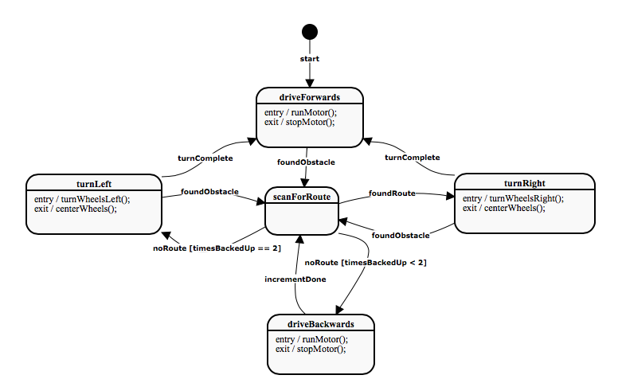
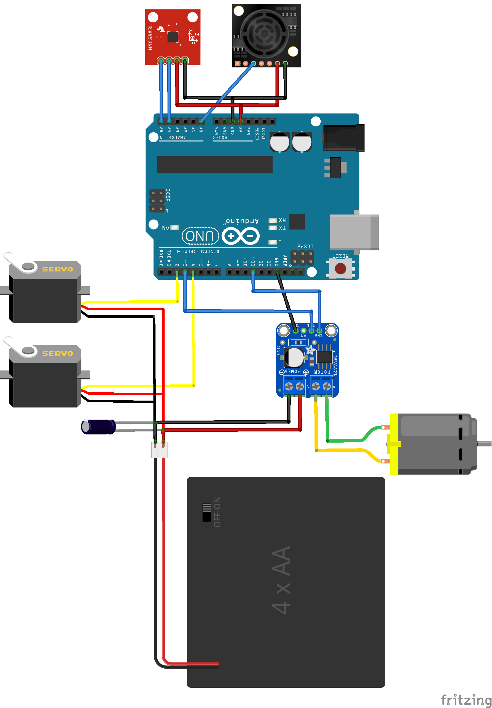

# self-driving-car

## Purpose:
A lab project for CSC-385:to build and program an autonomous vehicle capable of driving around the central pod of desks in the lab room BA 3165.

## Software design:

We implemented a state machine to govern the car's behaviour.

## Hardware design:

The microcontroller is an ATMega 328P (Arduino UNO). The additional devices are:
- sonar rangefinder MaxSonar 1010
- magnetometer HMC5883L
- two servos Fitec FS90; one for steering, the other to orient the rangefinder
- one H-bridge motor driver L9110

